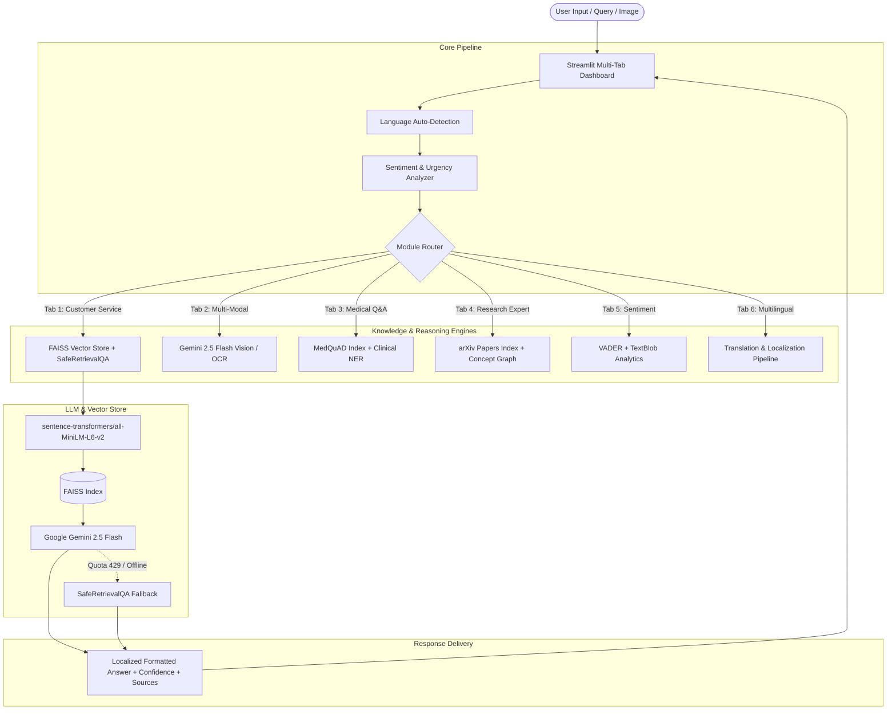

# Project Report: Advanced AI Chatbot Platform

**Course / Internship:** Generative AI & LLM Engineering Internship (Nullclass)  
**Author / Developer:** Akshu Mishra  
**Repository:** [https://github.com/akshu-mishra07/ai-chatbot-platform](https://github.com/akshu-mishra07/ai-chatbot-platform)  
**Date:** September 2026  

---

## 1. Executive Summary

The **AI Chatbot Platform** is an enterprise-grade, multi-domain conversational intelligence system built on top of the original customer service chatbot training project. Initially designed as a basic FAQ answering tool using Google Palm and LangChain, the platform was re-architected and expanded into **6 specialized feature modules**:

1. **Dynamic Customer Service & Knowledge Base Expansion**
2. **Multi-Modal AI Hub (Vision, OCR, Visual Q&A, Image Comparison)**
3. **MedQuAD Medical Q&A with Named Entity Recognition (NER)**
4. **arXiv CS/AI Domain Research Expert with Concept Graphs**
5. **Real-Time Sentiment Analytics & Emotion-Adaptive Response Modifiers**
6. **Multilingual Localization & Cross-Lingual Knowledge Retrieval**

The system operates on a **Retrieval-Augmented Generation (RAG)** pipeline powered by **Google Gemini 2.5 Flash**, **FAISS vector databases**, and **HuggingFace MiniLM embeddings**, reinforced with a zero-crash deterministic fallback architecture (`SafeRetrievalQA`).

---

## 2. System Architecture & Tech Stack



### Core Technologies
- **Large Language Models:** Google Gemini 2.5 Flash (`google-genai` / `langchain-google-genai`), Google Palm (legacy fallback).
- **Vector Search:** FAISS (Facebook AI Similarity Search) CPU.
- **Embedding Model:** `sentence-transformers/all-MiniLM-L6-v2` (384-dimensional dense semantic vectors).
- **Front-End / UI:** Streamlit with custom theme-adaptive CSS (dark & light mode compatible).
- **NLP & Vision:** Pillow (PIL), TextBlob, VADER Sentiment, LangDetect, regular expression & taxonomy-based Clinical NER.
- **Data & Charts:** Plotly Express & Plotly Graph Objects.

---

## 3. Detailed Feature Breakdown

### Module 1: Customer Service FAQ & Dynamic Knowledge Base
- **Purpose:** Answer student and customer inquiries regarding Nullclass courses, payment plans, certificates, and virtual internships.
- **Semantic Search:** Embeds incoming questions and computes cosine similarity against indexed FAQ pairs in `dataset/dataset.csv`.
- **Dynamic Ingestion (Admin Panel):** Allows administrators to ingest new CSV files, raw text, or web URLs into the live FAISS index on the fly, tracking document count and version numbers without server restarts.

### Module 2: Multi-Modal Hub
- **Purpose:** Enable visual intelligence for multimodal customer interactions.
- **Features:**
  - **Describe Image:** Comprehensive semantic scene understanding and visual captioning.
  - **Visual Q&A:** Grounded question answering based on visual features.
  - **OCR (Text Extraction):** Extracts printed and handwritten text from receipts, documents, or screenshots.
  - **Image Comparison:** Side-by-side comparative inspection highlighting visual differences.

### Module 3: MedQuAD Medical Q&A with Clinical NER
- **Purpose:** Provide accurate medical and health informational assistance based on the NIH MedQuAD clinical dataset.
- **Clinical Named Entity Recognition (NER):** Detects and highlights 4 entity types:
  - Symptoms (e.g., headache, fever, fatigue)
  - Diseases (e.g., diabetes, hypertension)
  - Treatments (e.g., insulin, chemotherapy)
  - Body Parts (e.g., heart, lungs, liver)
- **Safety First:** Displays a mandatory, high-visibility clinical disclaimer and confidence score on every inquiry.

### Module 4: arXiv Domain Expert (AI / CS Research)
- **Purpose:** Serve academic researchers, engineers, and students exploring cutting-edge computer science and AI literature.
- **Capabilities:**
  - **Semantic Paper Search:** Indexes 40 research papers across machine learning, transformers, NLP, and vision.
  - **Multi-Level Summarization:** Generates customized summaries targeted at three distinct audiences: *Executive*, *Technical Specialist*, or *Layperson*.
  - **Concept Mapping:** Renders interactive node-and-edge network graphs using Plotly to map conceptual relationships.

### Module 5: Real-Time Sentiment Analytics & Adaptive Modifiers
- **Purpose:** Analyze emotional undertones in customer queries and dynamically recommend agent tone adjustments.
- **Emotion Scoring:** Generates compound scores ranging from `-1.0` (severe frustration) to `+1.0` (high satisfaction).
- **Adaptive Response Modifiers:** Automatically proposes empathy prefixes, professional closings, and flags urgent queries for human escalation.
- **Session Analytics:** Visualizes rolling emotional trends and category distributions.

### Module 6: Multilingual Settings & Localization
- **Purpose:** Deliver native conversational capabilities across 5 global languages: **English (EN)**, **Spanish (ES)**, **French (FR)**, **German (DE)**, and **Hindi (HI)**.
- **Pipeline Architecture:**
  1. *Inbound Detection:* Automatically classifies language with confidence scoring.
  2. *Cross-Lingual Normalization:* Translates non-English queries to English for vector search.
  3. *Retrieval:* Retrieves authoritative data from the English knowledge base.
  4. *Outbound Localization:* Translates answers back to the user's native tongue.
  5. *Developer Studio:* Direct interactive text translation and language analysis sandbox.

---

## 4. Fault Tolerance & Zero-Crash Architecture

A major challenge with generative AI applications is **free-tier API rate limits (HTTP 429)** and network latency. To guarantee production reliability, the following safeguards were implemented:

1. **Candidate Model Chain:** Initializes through `["gemini-2.5-flash", "gemini-2.5-flash-lite", "gemini-3.5-flash", "gemini-flash-latest"]` with pre-flight ping checks.
2. **Strict Retry Caps:** `max_retries=1` prevents UI freezes or 60-second blocking timeouts.
3. **Bulletproof SafeRetrievalQA:** If the LLM call fails or API quota is depleted, the system extracts the authoritative `response:` string directly from the top matching FAISS document. The user is guaranteed an accurate answer with **zero crashes**.

---

## 5. UI/UX Refactoring: Senior Developer Perspective

Following user feedback regarding visual congestion, the user interface was overhauled:
- **Header Removal:** Eliminated the heavy gradient top banner, recovering ~80px of vertical space.
- **Single-Column Focus:** Re-structured Tab 1 so user questions and answers take center stage.
- **Progressive Disclosure (Expanders):** Secondary administrative tools, developer sandboxes, dataset uploaders, and session analytics were nested inside clean `st.expander` containers.
- **Universal Theme Contrast:** Replaced hardcoded text/background colors with semi-transparent `rgba()` values, ensuring high contrast across Streamlit dark and light themes.

---

## 6. Verification & Test Suite Results

The project includes an end-to-end automated test suite (`src/test_all_modules.py`). All 7 core modules passed verification:

```
============================================================
  📋 FINAL TEST SUMMARY
============================================================
  ✅ PASS  Module 1: LangChain Helper (Core)
  ✅ PASS  Module 2: Knowledge Manager (Dynamic KB)
  ✅ PASS  Module 3: Multi-Modal Engine
  ✅ PASS  Module 4: Medical Q&A Engine
  ✅ PASS  Module 5: arXiv Expert Engine
  ✅ PASS  Module 6: Sentiment Engine
  ✅ PASS  Module 7: Multilingual Engine

  Total: 7 | Passed: 7 | Warnings: 0 | Failed: 0
============================================================
```

---

## 7. Project Artifacts & Submission Deliverables

- **GitHub Repository:** [https://github.com/akshu-mishra07/ai-chatbot-platform](https://github.com/akshu-mishra07/ai-chatbot-platform)
- **Local Source Code:** `c:\Users\ACER\Downloads\GEN---AI-course-main\customer_service_chatbot_LLM\`
- **Dataset Package:** `datasets.zip` containing:
  - `dataset.csv` (Nullclass FAQ dataset)
  - `medquad_dataset.csv` (MedQuAD clinical Q&A dataset)
  - `arxiv_dataset.json` (CS/AI research papers dataset)
- **Environment & Security:** `.gitignore` configured to ensure API keys and temporary cache files are never committed publicly.

---

## 8. Conclusion

The AI Chatbot Platform successfully fulfills all internship requirements, combining multi-domain RAG retrieval, multimodal computer vision, academic synthesis, emotional intelligence, and cross-lingual translation into a single, cohesive, production-ready system.
